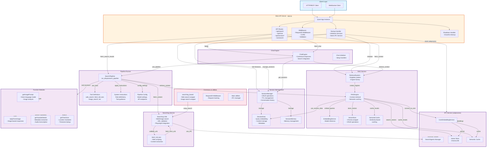

# ElixpoSearch API Architecture

## Module Hierarchies

```mermaid
graph TB
    subgraph Client["Client Layer"]
        HTTP[HTTP/REST Client]
        WS[WebSocket Client]
    end

    subgraph API["Main API Server - app.py"]
        APP[Quart App Instance]
        ROUTES["API Routes<br/>- /api/search<br/>- /api/chat<br/>- /api/session/*<br/>- /ws/search"]
        MIDDLEWARE["Middleware<br/>- RequestID Middleware<br/>- CORS<br/>- Validation"]
        STARTUP["Startup Handler<br/>- Initializes Services<br/>- Starts IPC Service"]
        SHUTDOWN["Shutdown Handler<br/>- Graceful cleanup"]
    end

    subgraph IPC["IPC Service (subprocess)"]
        CORE_SVC["CoreEmbeddingService"]
        SEARCH_AGENT["SearchAgents Manager"]
        EMBEDDINGS["Vector Store<br/>Chroma DB"]
        SEMANTIC["Semantic Cache"]
    end

    subgraph Pipeline["Pipeline Runner"]
        SEARCH_PIPE["SearchPipeline<br/>run_elixposearch_pipeline"]
        TOOLS["Tool Definitions<br/>web_search, fetch_full_text,<br/>image_search, etc."]
        INSTRUCTIONS["System Instructions<br/>Role definitions,<br/>Tool guidance"]
        CONFIG["Pipeline Config<br/>Model settings,<br/>API endpoints"]
    end

    subgraph Session["Session Management"]
        SESSION_MGR["SessionManager<br/>- CRUD operations<br/>- TTL management<br/>- Conversation history"]
        SESSION_DATA["SessionData<br/>- Query embedding<br/>- Content storage<br/>- Metadata"]
        SESSION_MEM["SessionMemory<br/>- Memory management"]
    end

    subgraph RAG["RAG Service"]
        RETRIEVAL_SYS["RetrievalSystem<br/>- Singleton pattern<br/>- Engine factory"]
        RAG_ENGINE["RAGEngine<br/>- Context retrieval<br/>- Semantic caching"]
        EMBED_SVC["EmbeddingService<br/>- Model inference"]
        VECTOR_STORE["VectorStore<br/>- Chroma wrapper<br/>- CRUD operations"]
        CACHE["SemanticCache<br/>- Similarity-based<br/>caching"]
    end

    subgraph Chat["Chat Engine"]
        CHAT_ENGINE["ChatEngine<br/>- Contextual responses<br/>- Search integration"]
        CHAT_INIT["Chat Initializer<br/>- Setup handlers"]
    end

    subgraph Search["Searching Service"]
        SEARCH_UTILS["Searching Utils<br/>- Web/Image search<br/>- URL validation<br/>- Playwright integration"]
        FETCH["fetch_full_text<br/>- Web scraping<br/>- Content extraction"]
    end

    subgraph FunctionCalls["Function Modules"]
        IMG_PROMPT["getImagePrompt<br/>- Vision-language model<br/>- Image analysis"]
        IMG_REPLY["replyFromImage<br/>- Image-based responses"]
        YT["getYoutubeDetails<br/>- Metadata extraction<br/>- Audio transcription"]
        TZ["getTimeZone<br/>- Location resolution<br/>- Timezone lookup"]
    end

    subgraph Commons["Commons & Utilities"]
        SEARCHING_BASED["searching_based<br/>- Web search wrapper<br/>- Image search wrapper"]
        REQUEST_ID["RequestID Middleware<br/>- Request tracking"]
        MAIN["Main utilities<br/>- IPC manager"]
    end

    %% Connections
    HTTP --> APP
    WS --> APP
    
    APP --> ROUTES
    APP --> MIDDLEWARE
    APP --> STARTUP
    APP --> SHUTDOWN
    
    STARTUP -->|starts subprocess| IPC
    STARTUP -->|Get Sessions| SESSION_MGR
    STARTUP -->|Initialize| RETRIEVAL_SYS
    STARTUP -->|Setup| CHAT_ENGINE
    
    ROUTES -->|fetch_search_results| SEARCH_PIPE
    ROUTES -->|fetch_chat| CHAT_ENGINE
    ROUTES -->|manage_sessions| SESSION_MGR
    ROUTES -->|fetch_context| RETRIEVAL_SYS
    
    SEARCH_PIPE -->|use_tools| TOOLS
    SEARCH_PIPE -->|apply_instructions| INSTRUCTIONS
    SEARCH_PIPE -->|config_settings| CONFIG
    SEARCH_PIPE -->|fetch_content| SEARCH_UTILS
    SEARCH_PIPE -->|call_functions| FunctionCalls
    SEARCH_PIPE -->|retrieve_context| RAG_ENGINE
    
    CHAT_ENGINE -->|get_sessions| SESSION_MGR
    CHAT_ENGINE -->|retrieve_context| RETRIEVAL_SYS
    CHAT_ENGINE -->|use_pipeline| SEARCH_PIPE
    
    SESSION_MGR -->|manage| SESSION_DATA
    SESSION_MGR -->|manage| SESSION_MEM
    
    RETRIEVAL_SYS -->|create_engines| RAG_ENGINE
    RAG_ENGINE -->|embed_queries| EMBED_SVC
    RAG_ENGINE -->|store_vectors| VECTOR_STORE
    RAG_ENGINE -->|cache_results| CACHE
    RAG_ENGINE -->|use_session_data| SESSION_DATA
    
    RAG_ENGINE -->|connect_to_core| CORE_SVC
    RAG_ENGINE -->|search_vectors| EMBEDDINGS
    RAG_ENGINE -->|cache_results| SEMANTIC
    
    SEARCH_UTILS -->|use_IPC| SEARCH_AGENT
    SEARCHING_BASED -->|wrap_search| SEARCH_UTILS
    SEARCH_UTILS -->|validate_urls| FETCH
    FETCH -->|fetch_from_urls| SEARCH_UTILS
    
    FunctionCalls -->|analyze| IMG_PROMPT
    FunctionCalls -->|reply| IMG_REPLY
    FunctionCalls -->|extract_metadata| YT
    FunctionCalls -->|lookup| TZ
    
    IPC -->|serve_embeddings| CORE_SVC
    IPC -->|manage_agents| SEARCH_AGENT
    CORE_SVC -->|persist| EMBEDDINGS
    CORE_SVC -->|cache| SEMANTIC

    %% Styling
    classDef client fill:#e1f5ff,stroke:#01579b,stroke-width:2px
    classDef api fill:#fff3e0,stroke:#e65100,stroke-width:2px
    classDef service fill:#f3e5f5,stroke:#4a148c,stroke-width:2px
    classDef pipeline fill:#e8f5e9,stroke:#1b5e20,stroke-width:2px
    classDef util fill:#fce4ec,stroke:#880e4f,stroke-width:2px

    class Client client
    class API api
    class IPC,Pipeline,Session,RAG,Chat,Search,FunctionCalls service
    class Commons util
```

