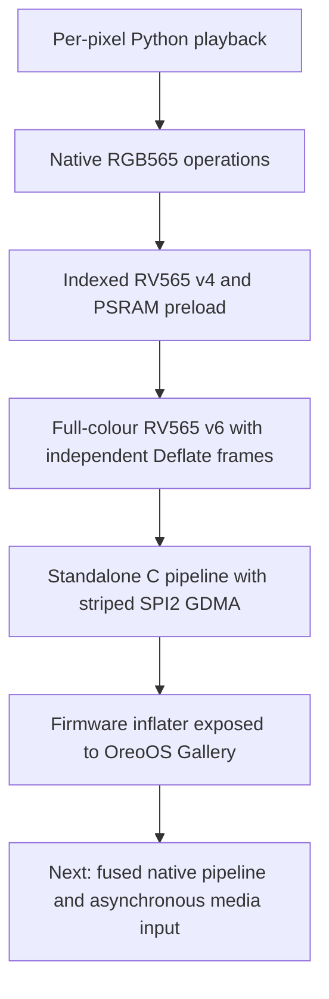
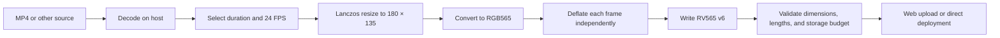
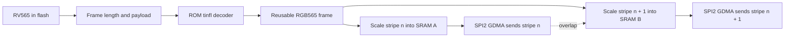
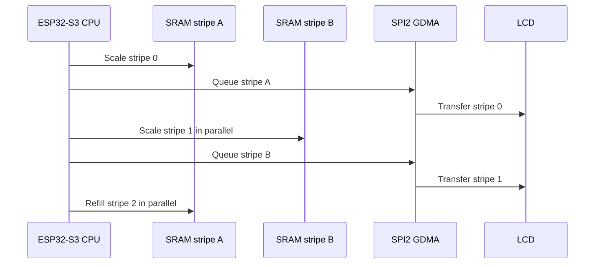
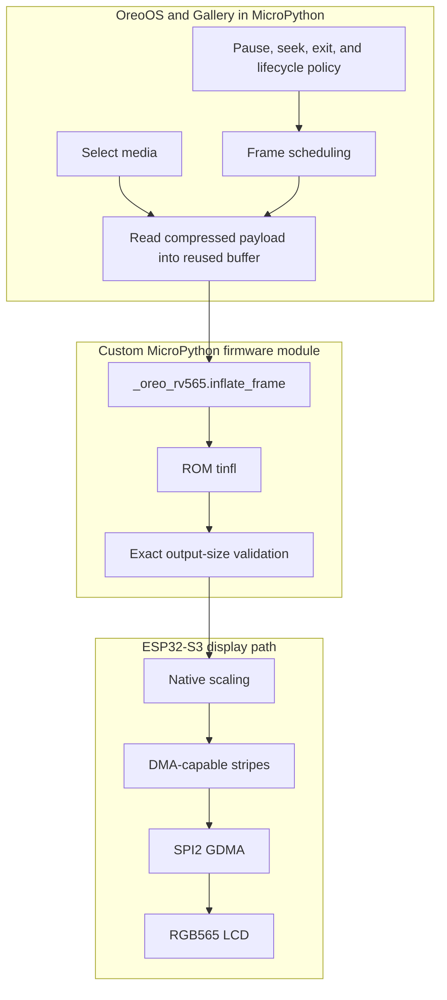
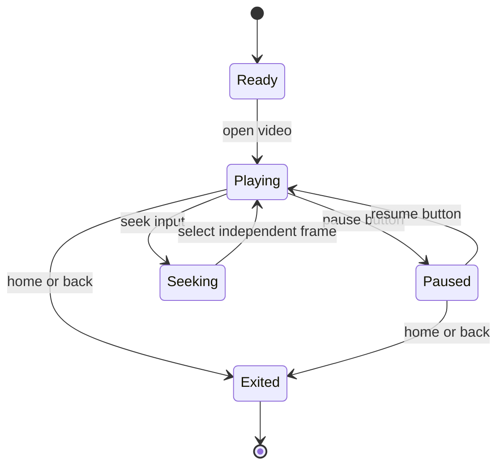
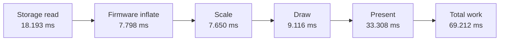
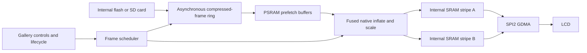
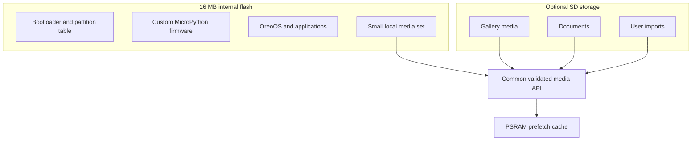

# RV565 on OreoOS

## A firmware-assisted video architecture for an ESP32-S3 badge

**Knowledge deck · engineering and research overview**

RV565 makes full-colour video practical on OreoOS by treating playback as a complete data-path problem: prepare display-native frames on the host, decode each frame through native firmware, reuse bounded buffers, and feed the LCD with DMA-aware scheduling.

> **Executive takeaway:** moving frame inflation into firmware removed a costly and unpredictable language-runtime boundary. Reaching 24 FPS, however, requires the entire path—not only decompression—to be pipelined.

---

# 1. What this deck explains

- What RV565 is—and what it is not
- Why ordinary video approaches performed poorly on the badge
- How frames move from an uploaded video to the LCD
- Why decompression was moved from MicroPython into custom firmware
- How double-buffered stripes and SPI2 GDMA sustain 24 FPS
- Why the integrated Gallery currently measures 14.09 FPS despite looking smooth
- What remains to bring the complete OreoOS path to a measured 24 FPS

**Audience:** OreoOS contributors, embedded engineers, research collaborators, and reviewers.

---

# 2. The problem is a deadline, not just a decoder

The badge uses a **320 × 240 RGB565** display. One full frame therefore contains:

$$
320 \times 240 \times 2 = 153{,}600\text{ bytes}
$$

At 24 FPS, a frame must be prepared and presented every:

$$
\frac{1}{24} = 41.667\text{ ms}
$$

With a 40 MHz SPI link, sending 153,600 bytes alone takes approximately **30.72 ms** before command overhead. That leaves only about **10.95 ms** for reading, decompressing, scaling, scheduling, and application work if everything is serialized.

**Key point:** a fast decoder cannot compensate for a serial display path that already consumes most of the frame budget.

---

# 3. Why conventional playback failed

The early Gallery path asked MicroPython to perform too much work per frame:

- parse and allocate compressed frame data;
- decompress through a high-level stream abstraction;
- scale or copy pixels;
- update the display synchronously;
- continue servicing buttons and the OreoOS lifecycle.

This produced low frame rates, allocation pressure, variable latency, and an unresponsive interface. Large raw RGB565 videos avoided decompression but consumed too much flash and still did not solve display-transfer latency.


**Failure mode:** all expensive stages waited for the previous stage, so their latencies accumulated.

---

# 4. The architecture evolved in layers



Each revision removed a different bottleneck:

1. display-native pixels removed colour conversion on the badge;
2. bounded reusable buffers removed per-frame allocation;
3. independent compression reduced storage without inter-frame state;
4. DMA stripes overlapped CPU work with LCD transfer;
5. firmware integration gave Gallery native decompression without giving up OreoOS controls.

---

# 5. RGB565 is the display-native pixel format

Each pixel is represented by 16 bits:

| Component | Bits | Range |
|---|---:|---:|
| Red | 5 | 0–31 |
| Green | 6 | 0–63 |
| Blue | 5 | 0–31 |

The LCD already consumes RGB565, so the device does not need to decode JPEG colour spaces, construct 24-bit RGB pixels, or quantize colours during playback.

Host-side conversion performs the expensive visual preparation once:

- resize the source with a high-quality filter;
- convert it to RGB565 in the LCD byte order;
- compress each complete frame independently;
- write deterministic dimensions, frame rate, and frame lengths.

**Design principle:** spend workstation-class compute during ingestion so the microcontroller performs bounded, predictable work during playback.

---

# 6. What RV565 actually is

RV565 is an OreoOS-oriented **frame container and playback contract**. It is not a newly invented entropy codec.

In the current v6 format:

- the file begins with a compact fixed header;
- each frame is stored as a 32-bit compressed length followed by one zlib-wrapped Deflate payload;
- every payload expands to exactly one RGB565 frame;
- frames are independently decodable.

For the current video asset, one decoded source frame is:

$$
180 \times 135 \times 2 = 48{,}600\text{ bytes}
$$

```text
+----------------------+  file header
| RV565 v6 metadata    |
+----------------------+
| compressed_size[0]   |
+----------------------+
| zlib frame 0         |  -> exactly 48,600 RGB565 bytes
+----------------------+
| compressed_size[1]   |
+----------------------+
| zlib frame 1         |
+----------------------+
| ...                  |
+----------------------+
```

Independent frames make seeking direct, constrain corruption to a frame, and eliminate inter-frame decoder state.

---

# 7. Media is prepared before it reaches the badge



The ingestion layer should reject unsuitable media before transfer. The same policy can govern images and documents: inspect, normalize, estimate final storage use, validate the result, and only then copy it to internal flash or future SD storage.

**Benefit:** malformed or oversized input never becomes a playback-time surprise.

---

# 8. The proven standalone 24 FPS path

The isolated ESP-IDF experiment removes MicroPython, the launcher, Wi-Fi, and the normal OreoOS framebuffer so the media path can be measured directly.



One stripe is transferred while the CPU prepares the next. The pipeline converts waiting time into useful scaling work and avoids allocating a complete 320 × 240 output framebuffer.

---

# 9. Double buffering is the central overlap



The two buffers must live in DMA-capable internal SRAM. The decoded source frame may live in a larger memory region because the CPU reads it, but the SPI DMA engine needs buffers with the correct capabilities and alignment.

**Key point:** DMA is not merely a faster copy; it creates concurrency between pixel preparation and physical display transfer.

---

# 10. Memory placement follows access behaviour

| Data | Preferred location | Reason |
|---|---|---|
| Compressed RV565 media | Internal flash; future SD | Capacity and persistence |
| Compressed read/prefetch buffer | PSRAM | Large enough to absorb storage jitter |
| Decoded 180 × 135 RGB565 frame | Reusable PSRAM or suitable heap | Fixed 48,600-byte working set |
| Alternating output stripes | DMA-capable internal SRAM | Required by SPI2 GDMA and low latency |
| Metadata and control state | Internal RAM | Small, frequently accessed |

The standalone benchmark uses about **79.9 KiB** of internal allocation for decoder state and stripe buffers, excluding its measurement sample array. It does not require a full display-sized framebuffer.

---

# 11. Why decompression moved into firmware

The ESP32-S3 ROM already contains miniz's `tinfl` implementation. Calling it from a native MicroPython module gives OreoOS a narrow, efficient operation:

```python
written = _oreo_rv565.inflate_frame(compressed_view, decoded_buffer)
```

The firmware function:

1. accepts a read-only buffer and a writable destination;
2. inflates directly from one reused buffer into another;
3. parses the zlib wrapper in native code;
4. verifies that the output length exactly equals the destination length;
5. raises an error for an empty or invalid frame.

There is no temporary Python `bytes` object and no Python loop over pixels.

**Reason for the move:** decompression is a stable, hardware-adjacent primitive with strict timing and memory requirements. Gallery navigation, user policy, and lifecycle handling remain easier to evolve in Python.

---

# 12. The firmware boundary is deliberately small



This is a **policy/mechanism split**:

- Python decides *what* to play and how the user controls it.
- Firmware performs the bounded decode primitive.
- Native display code controls *how* pixels reach the panel efficiently.

---

# 13. What the firmware move solved

| Before | Firmware-assisted path |
|---|---|
| Python-managed decompression stream | ROM `tinfl` called from C |
| Temporary compressed `bytes` objects | Reused source `memoryview` |
| New output objects per frame | Reused writable RGB565 buffer |
| Variable interpreter overhead | Bounded native routine |
| Weak frame-size guarantees | Exact decoded-length validation |
| Decoder competes with controls in Python | Decode time leaves Python sooner |

It also made the primitive reusable by other applications without duplicating decompression logic.

What it **did not** solve by itself:

- storage-read latency;
- a serialized scale/draw/present path;
- framebuffer copies outside the inflater;
- LCD wire time;
- scheduling performed after expensive synchronous work.

---

# 14. Scheduling keeps the system responsive

A real-time media loop should present at most one frame per application tick. If the loop is late, it should advance deliberately rather than run an unbounded burst of catch-up work.



Button inputs are debounced with a short software guard. Playback checks control state between bounded frame operations; the DMA engine continues transferring the current stripe without holding the interpreter in a pixel loop.

**Responsiveness comes from bounded work units, not from interrupting arbitrary decoder state.**

---

# 15. How the results were measured

Both paths use a repeatable measurement protocol:

- warm up for 48 frames (two seconds at the 24 FPS target);
- measure 720 frames (30 seconds at the target rate);
- store frame timings in RAM during the timed window;
- print the samples only after measurement;
- validate sequence completeness on the host;
- report mean, p50, p95, p99, and maximum latency;
- hash the relevant firmware, media, and application artifacts.

The integrated Gallery probe separately records storage read, inflate, scale, draw, display present, total work, skipped frames, and deadline misses.

This avoids making serial logging part of the workload being measured.

---

# 16. Measured performance

| Configuration | Frames | Effective FPS | Drops | Deadline misses | Work p50 | Work p95 | Work p99 |
|---|---:|---:|---:|---:|---:|---:|---:|
| Standalone native DMA stripes | 7,200 across 10 runs | **24.004** | 0 | 0 | 38.552 ms | 39.690 ms | 40.206 ms |
| OreoOS Gallery with firmware inflater | 720 | **14.093** | 0 | 720 | 69.535 ms | 76.988 ms | 78.938 ms |

The standalone pipeline stays below the 41.667 ms deadline even at p99. The integrated path is stable, but its p50 work time already exceeds the deadline.

**Claim boundary:** the hardware and standalone architecture have demonstrated 24 FPS. The current full Gallery integration has not yet demonstrated 24 FPS under instrumentation.

---

# 17. Where the integrated frame budget goes

The current Gallery stages are largely serialized. Their measured mean times are:



| Stage | Mean time |
|---|---:|
| Storage read | 18.193 ms |
| Firmware inflate | 7.798 ms |
| Scale | 7.650 ms |
| Draw | 9.116 ms |
| Present | 33.308 ms |
| **Measured total work** | **69.212 ms** |

The stage means are rounded and instrumentation boundaries may overlap slightly, but the conclusion is unambiguous: presentation plus serial preparation cannot fit into a 41.667 ms window.

---

# 18. Why 14 FPS can still look smooth

The eye does not perceive frame rate alone. The integrated playback can look surprisingly acceptable because:

- frame delivery is regular rather than bursty;
- all 720 measured frames were presented with zero drops;
- the p50-to-p95 spread is modest for the complete workload;
- independent frames avoid decoder recovery artifacts;
- there is currently no audio clock exposing slow video time.

This is **smooth slow playback**, not verified real-time 24 FPS playback. Once synchronized audio is added, timing accuracy will matter as much as visual consistency.

**Engineering rule:** use instrumented frame timing for performance claims and visual inspection for experience validation; neither replaces the other.

---

# 19. The next integrated architecture



The next optimisation should target the whole critical path:

1. prefetch compressed frames into PSRAM to hide flash or SD latency;
2. fuse native inflate, scaling, and stripe production where practical;
3. send alternating stripes directly through SPI2 GDMA;
4. remove the intermediate full-frame draw/present copy;
5. preserve Python as the control plane rather than the pixel data plane.

This is the shortest route from the measured 69 ms integrated frame toward the proven sub-41.667 ms native path.

---

# 20. Storage is designed to grow outward

Internal flash should contain the boot-critical firmware, OreoOS, applications, and a bounded amount of media. A later SD card extends the media tier without changing the RV565 frame contract.



The decoder should not need to know whether a validated frame originated in internal flash, an upload, or an SD card.

---

# 21. Reliability properties

- **Exact output contract:** a frame is valid only if inflation produces the expected RGB565 byte count.
- **Independent recovery:** a corrupt frame does not poison a predictive decode chain.
- **Bounded memory:** source, destination, and stripe buffers are allocated once and reused.
- **Direct seeking:** frame offsets can be indexed without decoding earlier pictures.
- **Fail closed:** invalid headers, lengths, or payloads produce a broken-video error instead of writing beyond a buffer.
- **Reproducible evidence:** measurement outputs retain artifact hashes and raw per-frame samples.

For removable storage, the same parser must continue treating every header and size as untrusted input.

---

# 22. What is novel in the work

The contribution is not Deflate, RGB565, or DMA individually. It is the cross-layer design that combines them under a microcontroller frame deadline:

- a display-native, independently decodable media container;
- host-side quality work and device-side bounded work;
- a minimal firmware API inside a high-level operating environment;
- explicit memory placement across flash, PSRAM, and DMA-capable SRAM;
- overlap of scaling and LCD transfer through alternating stripes;
- integrated measurements that expose the remaining OS overhead.

This framing is both more accurate and stronger than claiming RV565 as a new compression algorithm.

---

# 23. Practical takeaways

1. **Optimise the critical path, not one function.** A native inflater helps, but a serialized framebuffer path can still dominate.
2. **Use the peripheral’s native format.** RGB565 avoids runtime colour conversion.
3. **Move mechanisms, not product policy, into firmware.** The C layer owns deterministic buffer operations; Gallery owns interaction.
4. **Overlap CPU and I/O.** Double-buffered DMA stripes are what make the 24 FPS deadline attainable.
5. **Measure inside the real OS.** A standalone ceiling and an integrated result answer different questions.
6. **Design ingestion and storage together.** Media must be transformed and validated before it reaches constrained storage.
7. **Keep claims honest.** OreoOS has a proven 24 FPS native pipeline and a currently measured 14.09 FPS Gallery path, with a concrete route to converge them.

---

# 24. Repository map

| Area | Source |
|---|---|
| RV565 firmware inflater | [`firmware/usermods/oreo_rv565/modoreo_rv565.c`](../firmware/usermods/oreo_rv565/modoreo_rv565.c) |
| Gallery integration | [`apps/gallery/src/app.py`](../apps/gallery/src/app.py) |
| Standalone DMA experiment | [`experiments/video_dma/`](../experiments/video_dma/) |
| Standalone benchmark collector | [`tools/collect_video_benchmark.py`](../tools/collect_video_benchmark.py) |
| Integrated Gallery collector | [`tools/collect_gallery_benchmark.py`](../tools/collect_gallery_benchmark.py) |
| Technical architecture document | [`docs/VIDEO_ARCHITECTURE.md`](VIDEO_ARCHITECTURE.md) |
| Academic paper source | [`paper/rv565.tex`](../paper/rv565.tex) |
| Reproducible measurements | [`paper/measurements/`](../paper/measurements/) |

**One-sentence summary:** RV565 succeeds when compressed display-native frames, reusable memory, native firmware, and DMA scheduling operate as one pipeline.
