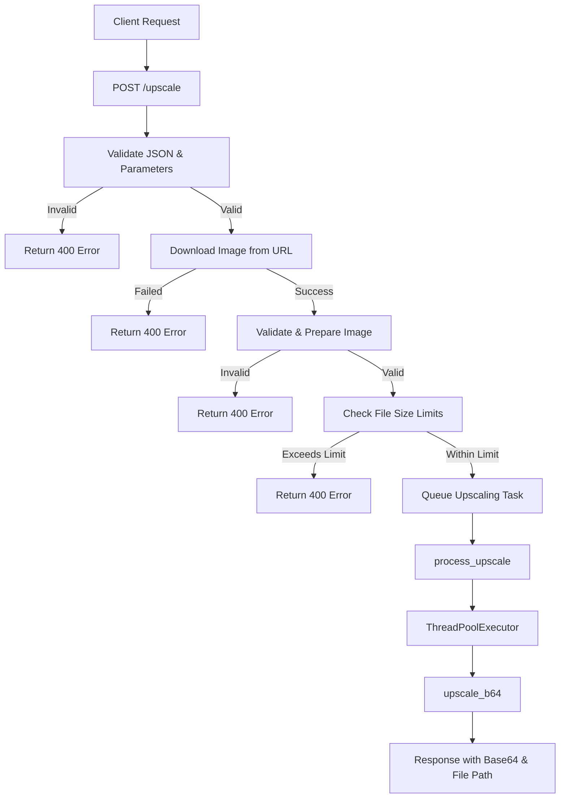
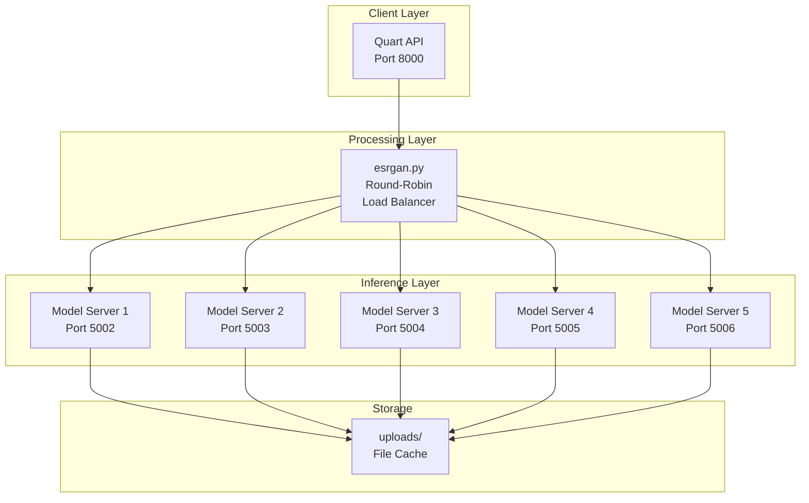
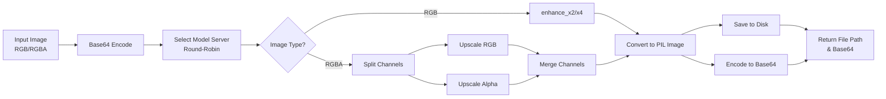
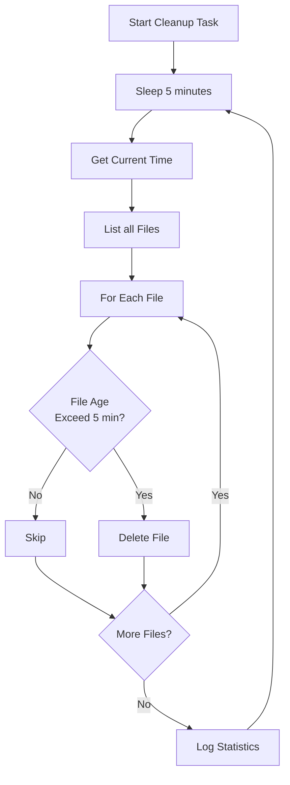

# Image Upscaling API

A high-performance image upscaling service using Real-ESRGAN models with multi-server architecture and distributed processing.

## Features

- **2x and 4x Image Upscaling** - Real-ESRGAN model-based enhancement
- **Multi-Server Architecture** - 5 concurrent model servers for load balancing
- **Async Processing** - Built with Quart for async HTTP handling
- **Automatic Cleanup** - Background task removes files older than 5 minutes
- **Base64 Support** - Direct base64 image input/output
- **Validation** - File size (7MB max) and dimension (2048px max) limits
- **Health Monitoring** - Status and health check endpoints

## Architecture

- **model_server.py** - RealESRGAN inference servers (port 5002+)
- **esrgan.py** - Client with round-robin server selection and image conversion
- **app.py** - Quart async API server (port 8000)

## Workflow Diagrams

### Request Processing Flow

### Server Architecture

### Image Processing Pipeline

### Background Cleanup Task

## API Endpoints

- `POST /upscale` - Upscale image (required: `img_url`, optional: `scale` [2/4])
- `GET /health` - Health check with limits
- `GET /status` - Server and resource status
- `POST /cleanup` - Manual file cleanup
